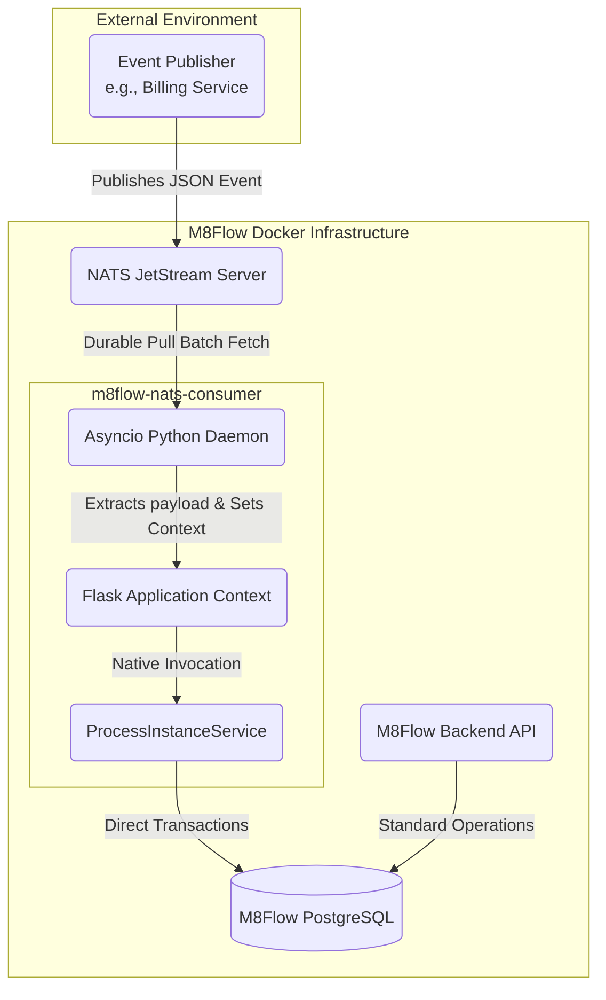
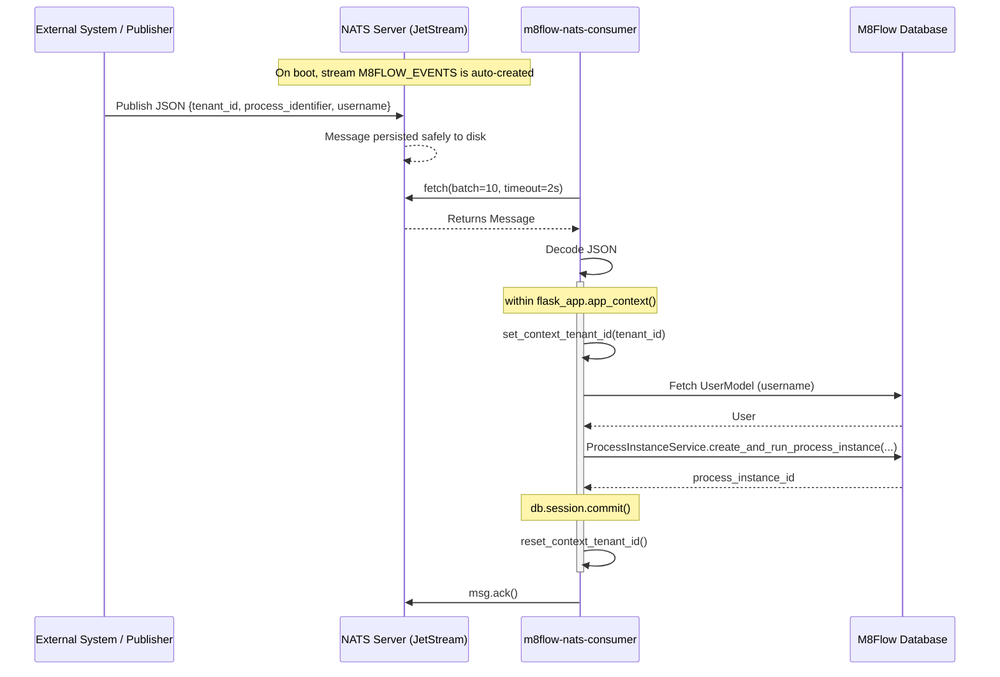

# M8Flow Event-Driven Architecture

M8Flow requires a way to be triggered automatically by external business events (e.g., "Order Placed", "Invoice Paid") without tight coupling to the event provider itself.

To achieve this, we built a standalone **NATS Consumer Service** (`m8flow-nats-consumer`) that acts as a secure, highly-integrated ingestion layer.

---

## 1. System Architecture

---

## 2. Core Concepts

- **Native Database Integration:** The NATS consumer is a standalone Python script that runs with direct access to the M8Flow and SpiffWorkflow backend libraries. It invokes internal Python services (like `ProcessInstanceService`) within a Flask application context to start processes instantly and efficiently.
- **Durable Pull Consumer:** The NATS consumer fetches batches of messages using JetStream pull subscriptions. This provides safety via backpressure, ensuring a massive influx of events cannot exhaust or overwhelm the backend system.
- **Multi-Tenant Context Switching:** The consumer supports triggering processes across multiple tenants by securely switching the active database tenant context (via `set_context_tenant_id`) before running the process, ensuring data isolation and correct execution.

---

## 3. Security & Execution Model

The architecture inherently protects the system while providing excellent performance:

1. **Direct Execution:** When the consumer reads a message off the NATS queue, it inspects the target `tenant_id` and `process_identifier` in the payload.
2. **Context Activation:** The consumer establishes a Flask application context and sets the active tenant context using `set_context_tenant_id`.
3. **User Resolution:** It dynamically resolves the user initiating the event (defaulting to a service account or tenant admin).
4. **Native Instantiation:** It securely invokes `ProcessInstanceService.create_and_run_process_instance` internally, bypassing the external API router layer.
5. **Clean Context:** After the process starts, it commits the database transaction and safely resets the tenant context, preventing state leakage across different events in the batch.

**Why this is exceptionally secure and fast:**

- **Direct Database Execution:** Triggering a workflow avoids unnecessary network layer overhead.
- **Internal Only:** The NATS consumer communicates directly with the database, meaning external actors cannot forge external API requests or bypass NATS.

---

## 4. Execution Flow Diagram

