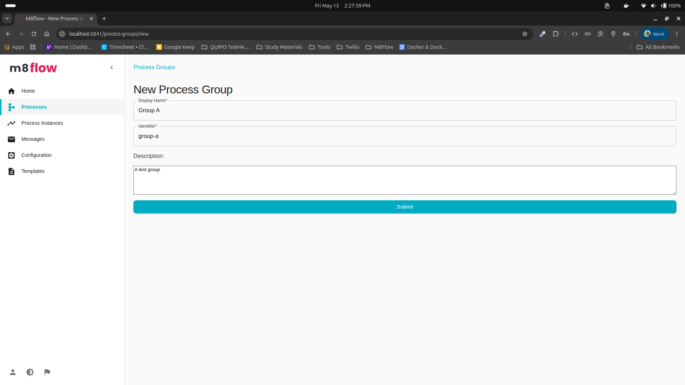
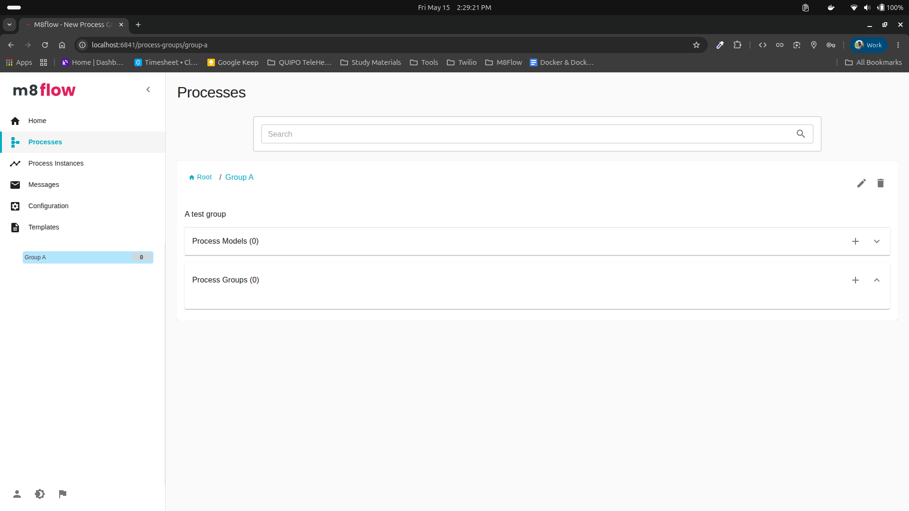
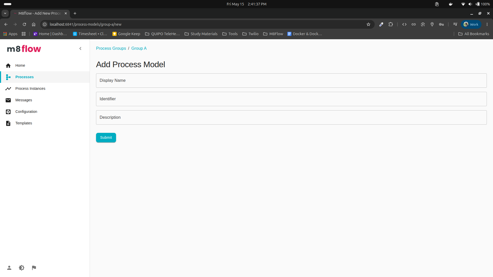
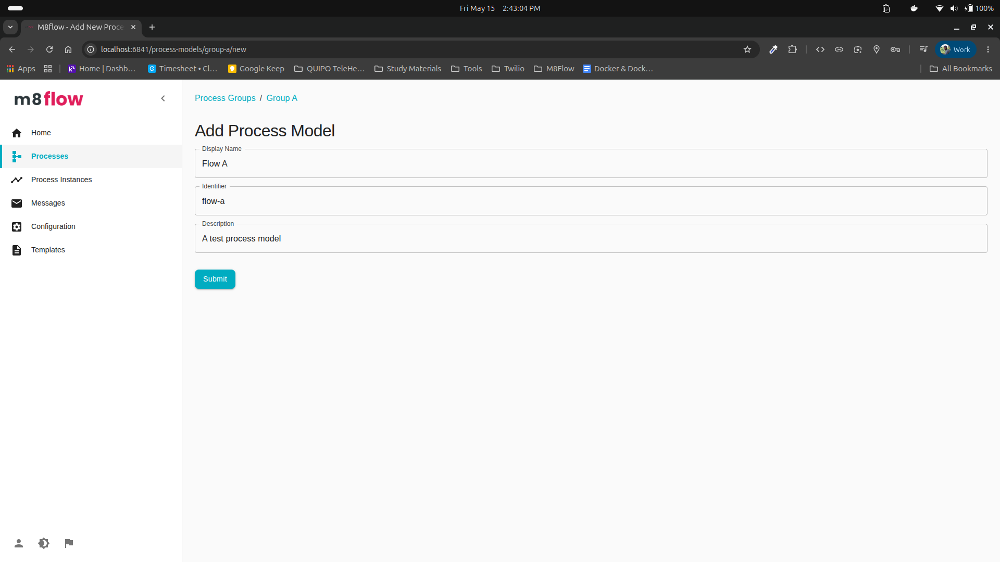
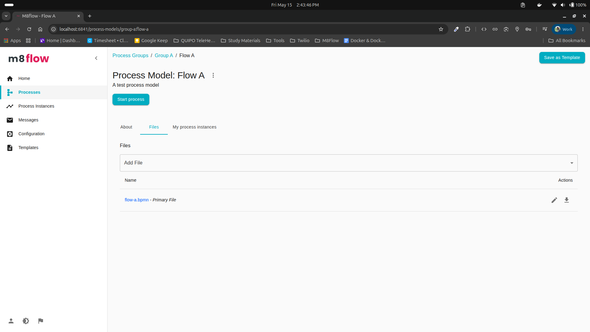

# How to Use m8flow

This guide walks through the first admin workflows after signing in.

Use this tutorial to learn the basic m8flow workflow setup: organize work with a process group, create a process model, and build your first workflow.

## Menu

- [Creating a process group](#creating-a-process-group)
- [Creating a process model](#creating-a-process-model)
- [Create the first workflow](#create-the-first-workflow)

## Before You Start

- Start m8flow and open [http://localhost:6841/](http://localhost:6841/).
- Sign in to the default `m8flow` tenant as `admin`.
- If this is your first login for the `admin` user, update the temporary password when prompted.

## Creating a Process Group

1. After signing in as `admin`, the admin home page opens.

   

      
   

2. Open **Processes** from the left sidebar.

   

      
   

3. In the **Process Groups** area, select the **+** button to create a process group.

   

      
   

4. Enter the process group details.

   | Field | Description | Example |
   |-------|-------------|---------|
   | **Display name** | Human-readable name shown in the UI. | `Group A` |
   | **Identifier** | Unique URL-friendly identifier. m8flow generates this from the display name, and you can edit it before submitting. | `group-a` |
   | **Description** | Short explanation of what the group contains. | `A test group` |

   

      
   

5. Select **Submit** to save the process group.

6. After the group is created, it appears in the **Process Groups** list.

   

      
   

7. Open the process group to view its details and continue creating process models inside it.

   

      
   

## Creating a Process Model

After creating a process group, open that group to create or import process models for the group.

1. In the process group details page, select the **+** button in the **Process Models** area.

   

      
   

2. Enter the process model details.

   | Field | Description | Example |
   |-------|-------------|---------|
   | **Display name** | Human-readable name shown in the UI. | `Flow A` |
   | **Identifier** | Unique URL-friendly identifier. m8flow generates this from the display name, and you can edit it before submitting. | `flow-a` |
   | **Description** | Short explanation of what the process model contains. | `A test process model` |

   

      
   

3. Select **Submit** to save the process model.

4. After the model is created, it appears in the **Process Models** list for the selected process group.

   

      
   

5. Open the process model to view its details and continue building the workflow.

   

      
   

## Create the First Workflow

After creating a process model, use the modeler to design and save your first workflow.

This section will be expanded with the full workflow creation steps.

## Next Steps

Use the menu above to move between the process group, process model, and first workflow sections.
