# How to Use m8flow

This guide walks through the first admin workflows after signing in.

Use this tutorial to learn the basic m8flow workflow setup: organize work with a process group, create a process model, and build your first workflow.

## Menu

- [Creating a process group](#creating-a-process-group)
- [Creating a process model](#creating-a-process-model)
- [Create the first workflow](#create-the-first-workflow)
- [How to Use the User Task](#how-to-use-the-user-task)
- [How to assign a task to User by Group](#how-to-assign-a-task-to-user-by-group)

## Before You Start

- Start m8flow and open [http://localhost:6841/](http://localhost:6841/).
- Sign in to the default `m8flow` tenant as `admin`.
- If this is your first login for the `admin` user, update the temporary password when prompted.

## Creating a Process Group

1. After signing in as `admin`, the admin home page opens.

   <div align="center">
      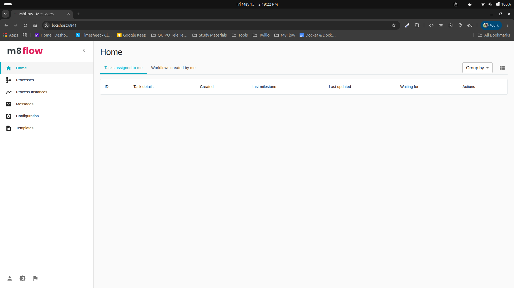
   </div>

2. Open **Processes** from the left sidebar.

   <div align="center">
      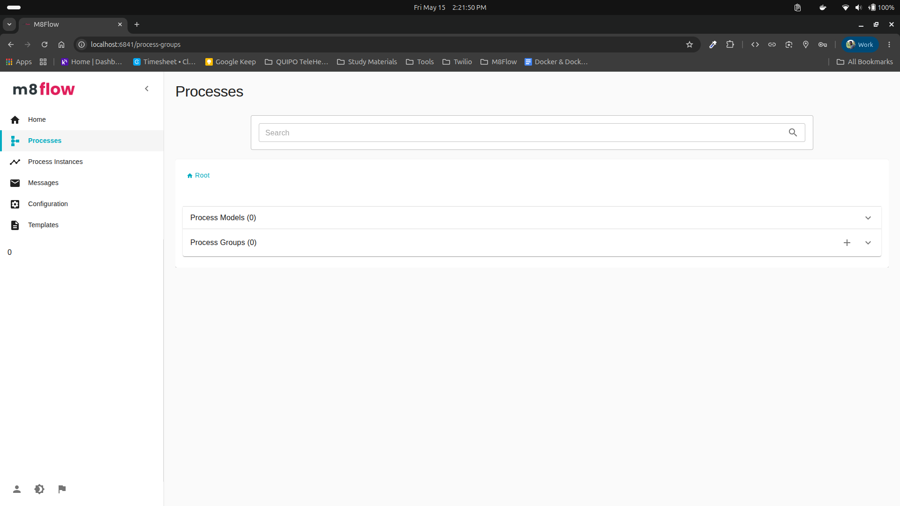
   </div>

3. In the **Process Groups** area, select the **+** button to create a process group.

   <div align="center">
      
   </div>

4. Enter the process group details.

   | Field | Description | Example |
   |-------|-------------|---------|
   | **Display name** | Human-readable name shown in the UI. | `Group A` |
   | **Identifier** | Unique URL-friendly identifier. m8flow generates this from the display name, and you can edit it before submitting. | `group-a` |
   | **Description** | Short explanation of what the group contains. | `A test group` |

   <div align="center">
      
   </div>

5. Select **Submit** to save the process group.

6. After the group is created, it appears in the **Process Groups** list.

   <div align="center">
      
   </div>

7. Open the process group to view its details and continue creating process models inside it.

   <div align="center">
      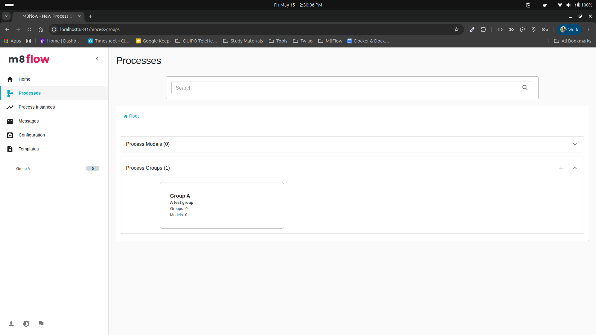
   </div>

## Creating a Process Model

After creating a process group, open that group to create or import process models for the group.

1. In the process group details page, select the **+** button in the **Process Models** area.

   <div align="center">
      
   </div>

2. Enter the process model details.

   | Field | Description | Example |
   |-------|-------------|---------|
   | **Display name** | Human-readable name shown in the UI. | `Flow A` |
   | **Identifier** | Unique URL-friendly identifier. m8flow generates this from the display name, and you can edit it before submitting. | `flow-a` |
   | **Description** | Short explanation of what the process model contains. | `A test process model` |

   <div align="center">
      
   </div>

3. Select **Submit** to save the process model.

4. After the model is created, it appears in the **Process Models** list for the selected process group.

   <div align="center">
      
   </div>

5. Open the process model to view its details and continue building the workflow.

   <div align="center">
      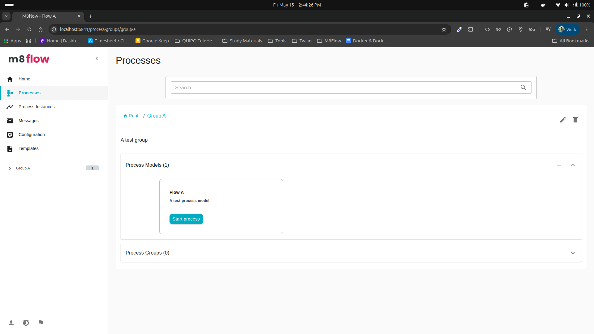
   </div>

## Create the First Workflow

After creating a process model, use the modeler to run your first workflow.

1. Open the process model. A default workflow is created automatically when the process model is created.

   <div align="center">
      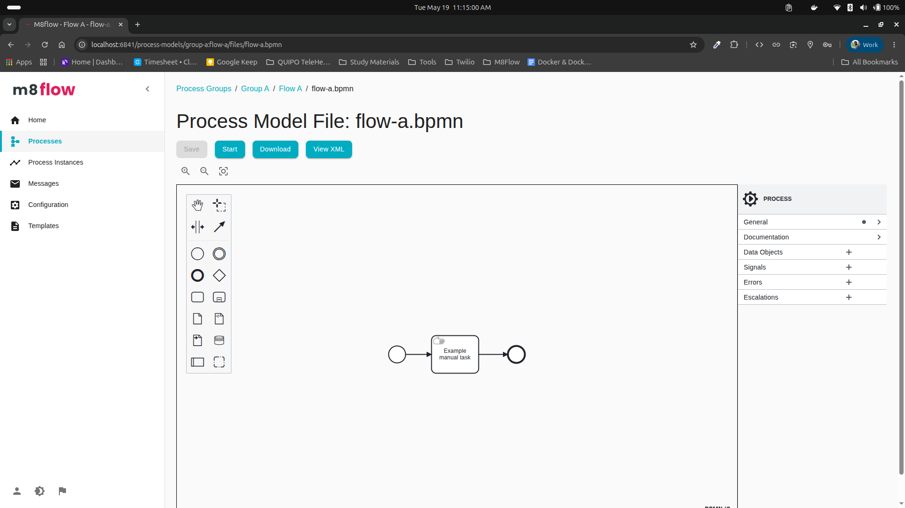
   </div>

2. Select the **Start** button at the top to start the workflow.

   <div align="center">
      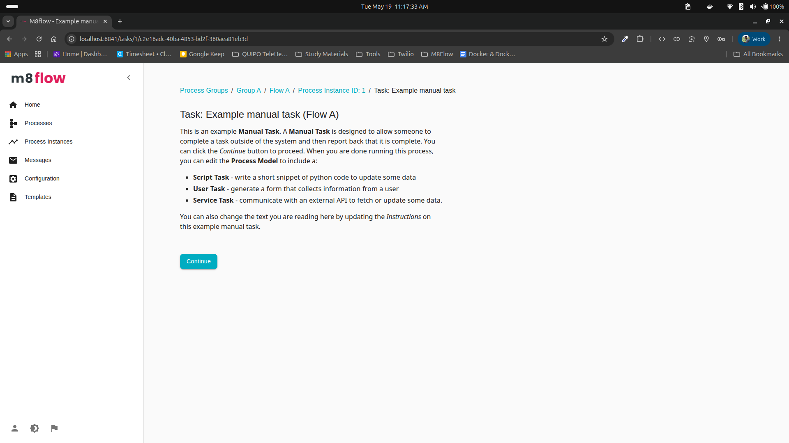
   </div>

3. Enter **Continue** when prompted. The workflow completes after the step is submitted.

4. Open **Process Instances** from the left sidebar to verify the workflow ran successfully. The instance appears with a **Completed** status.

   <div align="center">
      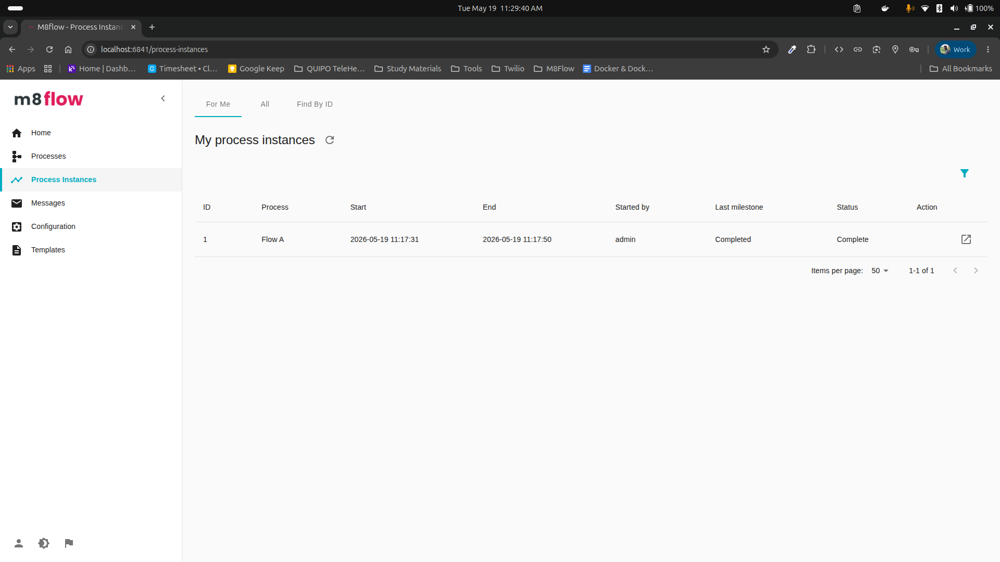
   </div>

## How to Use the User Task

After opening a process model, you can convert a task element to a user task and attach a form to it.

1. In the workflow, select the settings icon on a task element and choose **User Task** from the list. Alternatively, drag a new task box onto the canvas, select its settings icon, and choose **User Task**.

   <div align="center">
      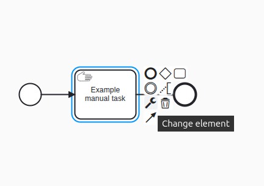
   </div>

2. Select the user task element to open its properties panel on the right side.

   <div align="center">
      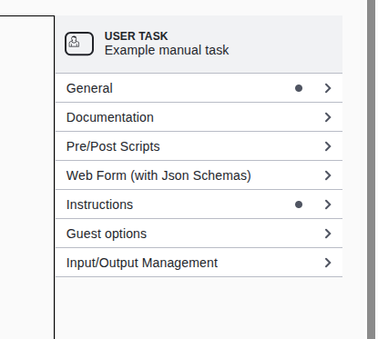
   </div>

   The properties panel contains the following tabs.

   | Tab | Description |
   |-----|-------------|
   | **General** | Set the name and ID for the user task. |
   | **Documentation** | Add documentation for the user task. |
   | **Pre/Post Scripts** | Add scripts to run before or after the task. |
   | **Web Form (JSON Schema)** | Attach a form to the user task. |
   | **Instructions / Labels** | Add Markdown instructions displayed above the form on the task page. |
   | **Guest Options** | Configure guest access options for the user task. |
   | **Input/Output Management** | Manage input and output variables for the user task. |

3. Open the **Web Form** tab and select **Launch Editor** to open the form editor.

   <div align="center">
      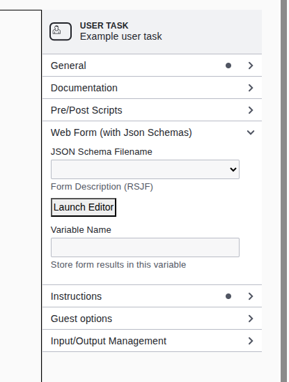
   </div>

   <div align="center">
      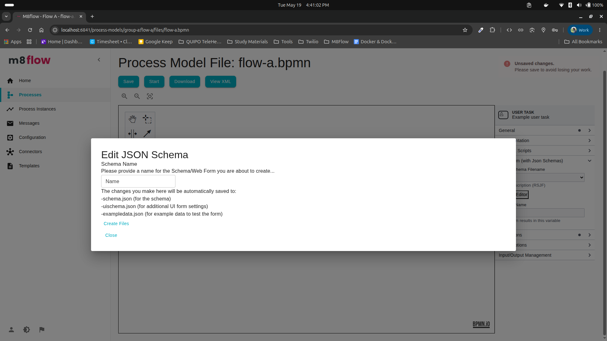
   </div>

4. Enter a name for the form (for example, `sample-form`) and select **Create Files**. Three files are created: `sample-form-schema.json`, `sample-form-uischema.json`, and `sample-form-exampledata.json`.

5. Copy the following content into the corresponding files.

   **`sample-form-schema.json`**

   ```json
   {
     "$schema": "http://json-schema.org/draft-07/schema#",
     "title": "Sample Form",
     "type": "object",
     "properties": {
       "name": {
         "type": "string",
         "title": "Name"
       },
       "email": {
         "type": "string",
         "title": "Email"
       },
       "age": {
         "type": "number",
         "title": "Age"
       },
       "gender": {
         "type": "string",
         "title": "Gender"
       },
       "address": {
         "type": "string",
         "title": "Address"
       }
     },
     "required": [
       "name",
       "email",
       "age",
       "gender",
       "address"
     ]
   }
   ```

   <div align="center">
      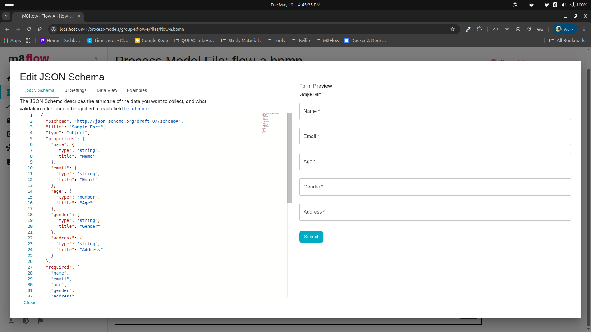
   </div>

   **`sample-form-uischema.json`**

   ```json
   {
     "type": "VerticalLayout",
     "elements": [
       {
         "type": "Control",
         "scope": "#/properties/name"
       },
       {
         "type": "Control",
         "scope": "#/properties/email"
       },
       {
         "type": "Control",
         "scope": "#/properties/age"
       },
       {
         "type": "Control",
         "scope": "#/properties/gender"
       },
       {
         "type": "Control",
         "scope": "#/properties/address"
       }
     ]
   }
   ```

   <div align="center">
      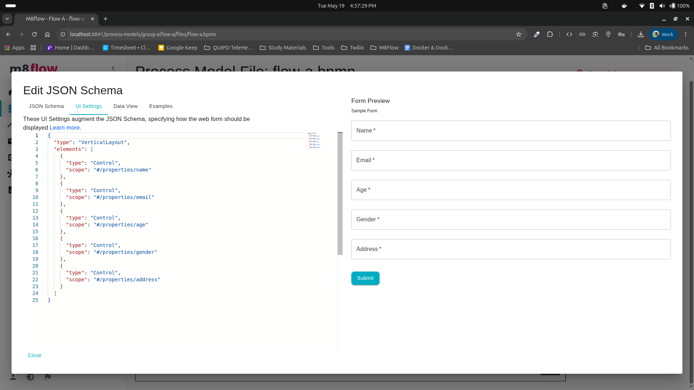
   </div>

6. Select **Close** in the bottom-left corner to return to the properties panel.

   <div align="center">
      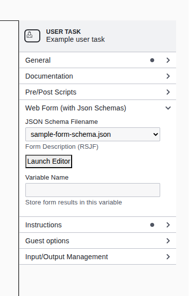
   </div>

7. Save the workflow and select **Start** to run the process.

   <div align="center">
      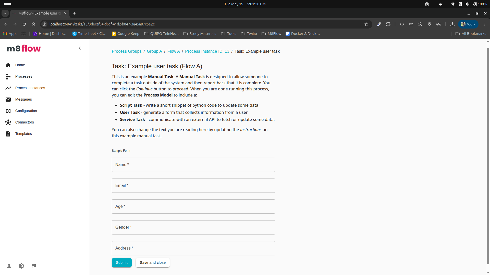
   </div>

   The task page displays the default instructions above the form.

8. Fill in the form and select **Submit** to complete the task.

   <div align="center">
      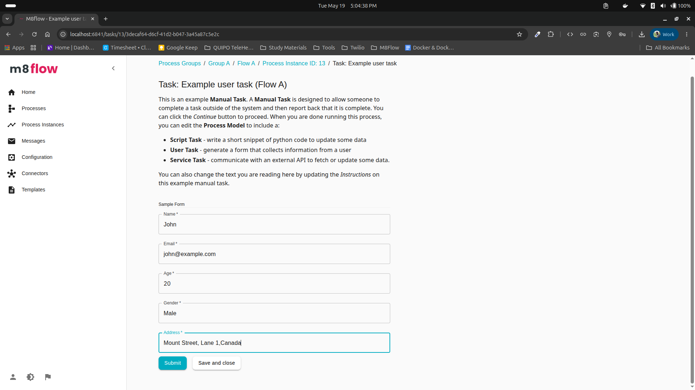
   </div>

9. Open **Process Instances** from the left sidebar to verify the workflow status.

10. To view the form associated with the process model, open the process model page.

    <div align="center">
       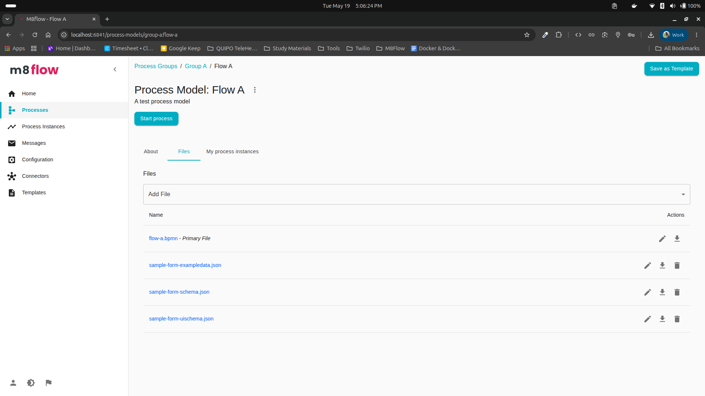
    </div>

## How to Assign a Task to a User by Group

After creating a process model, you can assign a user task to a specific group using swimlane pools.

1. Create a new process model and open it in the modeler.

2. Drag a **Pool** from the left panel onto the canvas. Convert the default task element in the pool to a **User Task** using the settings icon.

3. Split the pool into two lanes. Place the start event in the first lane (no name required) and the user task and end event in the second lane.

   To split the lane, select the lane and use the lane actions available on the right side of the pool.

   <div align="center">
      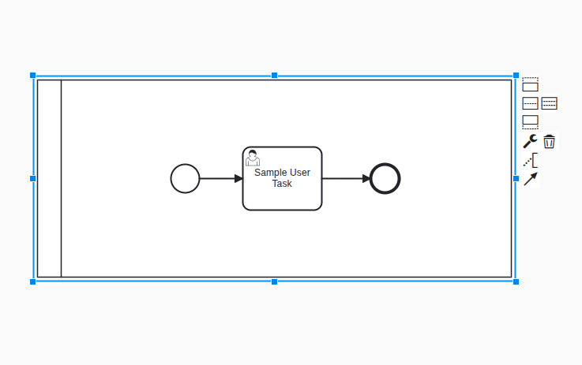
   </div>

4. Set the second lane name to match an existing group in Keycloak (for example, `HR`, `Reviewers`, or `Finance`).

   > **Note:** The group must exist in Keycloak, and the assigned user must belong to that group and have the correct role to access the task.

   <div align="center">
      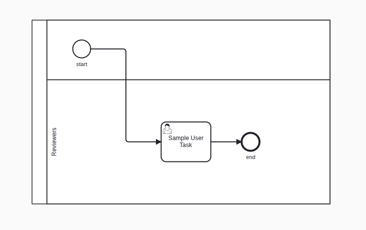
   </div>

5. Save the workflow and select **Start** to run the process.

6. Sign in as a user who belongs to the assigned group and verify that the task appears on their home page.

7. Complete the task and open **Process Instances** from the left sidebar to confirm the task status is updated.

